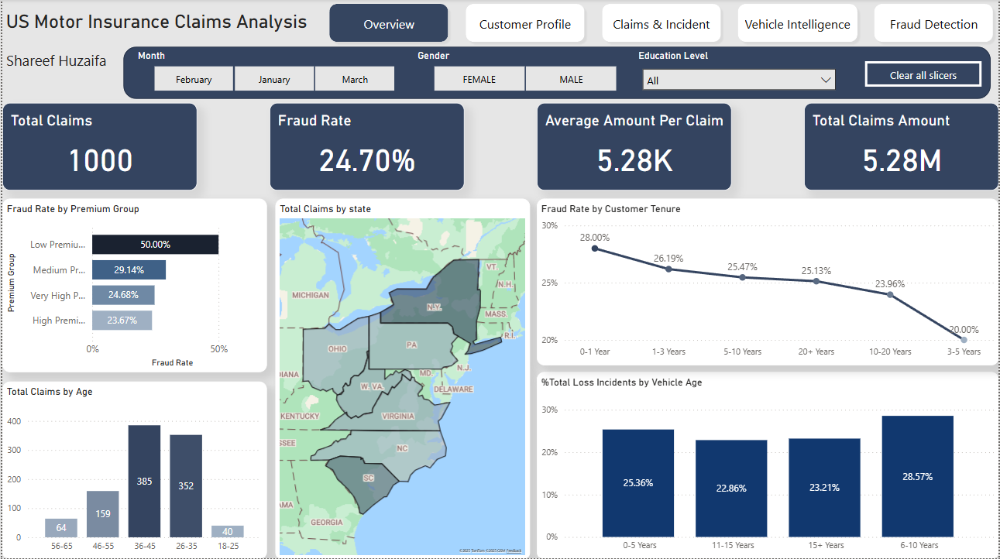

# 🚗 US Motor Insurance Claims Analysis – Power BI Dashboard  
📊 **End-to-End Power BI Case Study | Fraud Detection | Vehicle Intelligence | Claims Profiling**  
🌐 **[🔗 View Live Dashboard (Power BI Web)](https://app.powerbi.com/view?r=eyJrIjoiN2Y5YTMwNjctMzM3ZC00MGEwLWJhNTMtNmVmMWVjMjRlOGIwIiwidCI6IjY3NDM4ODYzLThjOTItNGQ0ZC1iMjAyLTIzNmZjMjNhZDk2MCIsImMiOjl9)**  

    <b>Overview Page</b>  
     
    

---

## 🔍 Project Overview  
This project delivers **deep insights into US motor insurance claims** from January to March, helping stakeholders identify **fraud patterns**, analyze **vehicle risk**, and understand **customer behavior.**  

### 🚀 Key Objectives  
✅ Enable **fraud detection** across demographic and behavioral segments  
✅ Understand **claim trends by incident, severity, and timing**  
✅ Assess **vehicle brands/models and injury patterns**  
✅ Visualize **total losses and premium-linked behaviors**  

---

## 📂 Dataset & Data Modeling  
🔹 Core dataset: **ClaimsData** with 1000 motor insurance claims  
🔹 Supporting dimension tables: Incident Type, Severity, Auto Make, Collision Type, Date  
🔹 Built a **star schema** for clean one-to-many relationships  

    <b>Data Model</b>  
     
    

---

## 📊 Power BI Pages & Features  

### 🔹 1. Overview  
✅ High-level KPIs: **Total Claims, Avg Claim, Total Fraud Rate**  
✅ Summary of fraud by **tenure and premium group**  
✅ State-level claims heatmap  
✅ Loss % by vehicle age  

### 🔹 2. Customer Profile  
✅ Claims breakdown by **age, gender, education, occupation**  
✅ Customer tenure trends with claim count & claim amount  

    

### 🔹 3. Claims & Incidents  
✅ Claims by **incident type, hour, severity, damage**  
✅ Contacted authorities and state-wise breakdown  

    

### 🔹 4. Vehicle Intelligence  
✅ Claims & fraud by **vehicle model and make**  
✅ Injury statistics by car model  
✅ **Vehicle age vs loss trends**

    

### 🔹 5. Fraud Detection  
✅ Fraud Rate by **Age, Incident, Tenure, Premium, Car Company**  
✅ Patterns in **low-premium customers and older drivers**  
✅ Single-vehicle & multi-vehicle collisions linked to higher fraud

    

---

## 📈 Key Insights  
🔹 **50% fraud** rate in **low-premium customers**  
🔹 Older drivers (56–65) showed highest fraud likelihood  
🔹 **Single-vehicle collisions** had the highest fraud rates  
🔹 **Jetta and RAM** models involved in most bodily injuries  
🔹 **Claims peak** between **3–5 AM** and **4–6 PM**  

---

## 🛠️ How to Use the Dashboard  
1️⃣ Open the `.pbix` file or view via Power BI Service  
2️⃣ Use filters (Month, Gender, Education) to explore  
3️⃣ Navigate using the page buttons at the top  

👉 **[📥 Download .pbix (Coming Soon)]()**  
🌐 **[🔗 View Live Dashboard (Power BI Web)](https://app.powerbi.com/view?r=eyJrIjoiN2Y5YTMwNjctMzM3ZC00MGEwLWJhNTMtNmVmMWVjMjRlOGIwIiwidCI6IjY3NDM4ODYzLThjOTItNGQ0ZC1iMjAyLTIzNmZjMjNhZDk2MCIsImMiOjl9)**  

---

## 💡 Why This Project Matters  
✅ **Fraud Detection Logic** tied to business rules  
✅ **Structured Star Schema** with normalized tables  
✅ **Advanced DAX** measures & category segmentation  
✅ Real-world application for **insurance analytics teams**  

---

## 👨‍💻 About Me  
Hi, I'm **Shareef Ali**, a focused **Data Analyst** with a passion for solving business problems through data.  

📬 **Let’s connect!**  
🔗 **[GitHub Portfolio](https://github.com/shareef99997)**  
🔗 **[LinkedIn](https://www.linkedin.com/in/shareef-ali/)**  
🔗 **[Personal Website](https://www.shareefdev.com)**  

📢 **If this dashboard helped you, consider leaving a ⭐ on GitHub!**
